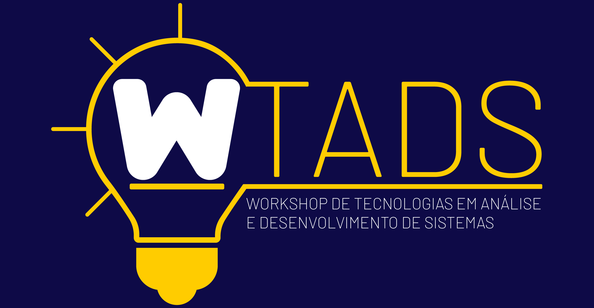

# Minicurso Vue.js [:page_facing_up:](https://medium.com/@kessiacastro/vue-js-tutorial-iniciando-com-componentes-4445b3eb0ffe)

Repositório oficial do minicurso de Vue.js promovido pelo **C**élula **A**cadêmico de **De**senvolvimento de **S**oftware (CADES) no [VII Workshop de Tecnologias em Análise e Desenvolvimento de Sistemas](http://diatinf.ifrn.edu.br/doku.php?id=extensao:eventos:2017:7wtads:start).

## Apresentação

- PDF :construction: 
- [Tutorial](https://medium.com/@kessiacastro/vue-js-tutorial-iniciando-com-componentes-4445b3eb0ffe)

## Prática [:arrow_upper_right:](https://github.com/kessiacastro/vue-tutorial)

#### Instalação

Antes de começar, você vai precisar:

* Node.js
* `npm` ou yarn
* vue-cli

Para mais instruções, [INSTALL.md](INSTALL.md).

## Instrutores

|  |  |  |
| ----- | ----- | ----- |
| [Késsia Castro](//github.com/kessiacastro) | [Albert Morato](//github.com/albert06) | [Mauro de Carvalho](//github.com/maurodecarvalho) |

## Apoio

|  |  |
| --- | --- |
| Instituto Federal do Rio Grande do Norte Campus Natal-Central Diretoria Acadêmica de Gestão e Tecnologia da Informação | Casa do Código |
